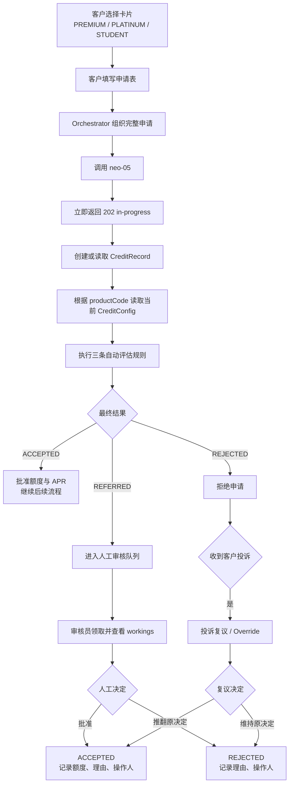

# Credit Decisioning 用户评估流程与规则

## 1. 文档目的

本文档记录 `neo-05` 当前已经确认的信用卡申请评估流程、产品配置、自动决策规则、人工审核流程和投诉复议流程，作为后续数据库与评估代码实现的共同依据。

当前范围只包含：

1. 最低收入资格检查；
2. 偿付能力（DTI）检查；
3. 三项额度取最小值并向下取整。

材料中的“每第 X 个合格申请抽样复核”规则暂不启用。UC 09–11 候选规则也不在当前范围内。

## 2. 系统边界

- 客户在整个银行系统的客户前端选择卡片并填写申请表。
- `neo-05` 不提供客户申请入口，也不能主动向自己的申请接口发送请求。
- 只有 orchestrator 调用 `POST /api/v1/applications`，并在请求信封中传入完整申请。
- `neo-05` 只读取信用评估所需字段，不保存完整申请表。
- 数据库中唯一允许保存的申请人标识是请求信封中的 `applicationId`。
- 姓名、生日、邮箱、手机号、地址和证件信息等个人数据不得持久化到本服务。
- 本服务只能读写自己的 MySQL schema，通过 REST 与 orchestrator 集成。

## 3. 整体评估流程



### 3.1 接收与幂等

`POST /api/v1/applications` 必须立即返回 HTTP `202`：

```json
{
  "status": "in-progress",
  "applicationId": "app-1234",
  "serviceId": "neo05",
  "command": "assess-credit"
}
```

处理要求：

- `applicationId` 是 `credit_record` 的主键；
- 同一个 `applicationId` 重复提交仍然只保留一条记录；
- 已完成的申请不能因为重复请求而重新计算；
- 已有结果应重放，而不是产生第二次业务处理；
- 自动评估必须在后台线程执行，不能阻塞 `202` 响应。

## 4. 产品模型

三类产品使用同一套评估算法，通过不同产品参数体现不同风险模型。

| 产品 | 最低年收入 `minIncome` | 最大额度 `maxLimit` | APR | 定位 |
|---|---:|---:|---:|---|
| `PREMIUM` | £12,000 | £5,000 | 29.9% | 普通门槛、中等额度 |
| `PLATINUM` | £20,000 | £10,000 | 24.9% | 较高门槛、较高额度、较低 APR |
| `STUDENT` | £0 | £1,000 | 34.9% | 无最低收入门槛、低额度、较高 APR |

共享配置：

| 配置 | 初始值 | 说明 |
|---|---:|---|
| `dtiLimit` | `0.45` | DTI 严格大于该值时转人工审核 |
| `roundingStep` | `100` | 额度最后向下取整到 £100 |
| `sampleEvery` | `7` | 字段可以保留，但当前不执行抽样规则 |

建议的初始 `productTerms`：

```json
{
  "PREMIUM": {
    "minIncome": 12000,
    "maxLimit": 5000,
    "apr": 29.9
  },
  "PLATINUM": {
    "minIncome": 20000,
    "maxLimit": 10000,
    "apr": 24.9
  },
  "STUDENT": {
    "minIncome": 0,
    "maxLimit": 1000,
    "apr": 34.9
  }
}
```

### 4.1 产品代码映射

内部配置使用 `PREMIUM`、`PLATINUM` 和 `STUDENT`。收到的实际 `productCode` 必须以 orchestrator 合同为准，并通过显式映射转换，不能使用字符串截断或模糊匹配。

可能的映射形式为：

```text
CREDIT_CARD_PREMIUM -> PREMIUM
CREDIT_CARD_PLATINUM  -> PLATINUM
CREDIT_CARD_STUDENT  -> STUDENT
```

正式编码前必须核实上游实际代码。未知产品不能默认套用 PREMIUM 配置，应当转为 `REFERRED` 并给出可读原因。

## 5. 自动评估输入

当前三条规则只读取以下字段：

```text
application.finances.annualIncome
application.finances.monthlyHousingCost
application.finances.existingCreditCommitments
application.product.productCode
application.product.requestedCreditLimit
```

所有数值输入均需要处理 `null`、负数及异常值。不能依赖 Java 基本类型把缺失值自动变成零。

## 6. 自动评估规则

### 6.1 Rule 1：最低收入资格

首先读取所选产品的 `minIncome`：

```text
annualIncome < product.minIncome
-> REJECTED
-> CRE_INCOME_BELOW_MINIMUM
```

边界规则：

```text
annualIncome == product.minIncome
-> 通过 Rule 1
```

Rule 1 是硬拒绝，优先级最高。命中后：

- 不再进行偿付能力检查；
- `dti` 为 `null`；
- 不计算批准额度；
- `grantedLimit` 为 `null`；
- `machineOutcome` 与 `outcome` 均为 `REJECTED`。

示例：

```text
年收入 £14,000，申请 PLATINUM
PLATINUM.minIncome = £20,000
14,000 < 20,000
-> REJECTED
```

同样的收入申请 PREMIUM 可以通过最低收入规则，因为 PREMIUM 的门槛为 £12,000。

### 6.2 Rule 2：偿付能力与 DTI

月收入使用整数除法，舍弃不足 £1 的部分：

```text
monthlyIncome = annualIncome / 12
```

月支出：

```text
monthlyOutgoings = monthlyHousingCost + existingCreditCommitments
```

DTI：

```text
dti = monthlyOutgoings / monthlyIncome
```

DTI 应使用 `BigDecimal` 计算，并按照明确方式保留两位小数，不能使用 `double` 参与最终业务判断。

判断规则：

```text
monthlyIncome == 0
-> dti = null
-> REFERRED

dti > 0.45
-> REFERRED

dti == 0.45
-> 通过 Rule 2

dti < 0.45
-> 通过 Rule 2
```

DTI 超标表示需要人工判断，不是直接拒绝。

示例：

```text
annualIncome = £48,000
monthlyIncome = £4,000
monthlyOutgoings = £2,320
dti = 0.58
0.58 > 0.45
-> REFERRED
-> CRE_AFFORDABILITY_EXCEEDED
```

STUDENT 的最低收入是 £0。零收入申请可以通过 Rule 1，但由于月收入为零、DTI 无法计算，必须进入人工审核，不能发生除零异常。

### 6.3 Rule 3：信用额度计算

额度由三个候选上限决定：

```text
incomeBasisLimit = monthlyIncome
productMaxLimit  = product.maxLimit
requestedLimit   = application.product.requestedCreditLimit
```

先取最小值：

```text
rawLimit = min(incomeBasisLimit, productMaxLimit, requestedLimit)
```

最后向下取整：

```text
grantedLimit = floor(rawLimit / roundingStep) * roundingStep
```

初始 `roundingStep` 为 £100。必须先取三个候选值的最小值，再执行取整。

额度原因：

| 最小候选值 | 原因代码 | 最终结果 |
|---|---|---|
| `incomeBasisLimit` | `CRE_APPROVED` | `ACCEPTED` |
| `requestedLimit` | `CRE_LIMIT_CAPPED_TO_REQUEST` | `ACCEPTED` |
| `productMaxLimit` | `CRE_LIMIT_CAPPED_TO_BAND_MAX` | `ACCEPTED` |

被客户申请额度或产品上限封顶仍然是批准，不是拒绝。

即使 Rule 2 已经把案件转为 `REFERRED`，仍建议完成额度计算并保存机器最高额度，以便人工审核员知道批准上限。

## 7. 各产品评估模型

### 7.1 PREMIUM

```text
minIncome = £12,000
maxLimit  = £5,000
apr       = 29.9%
```

额度公式：

```text
floor(min(monthlyIncome, 5000, requestedLimit) / 100) * 100
```

示例：

```text
annualIncome = £30,000
monthlyIncome = £2,500
monthlyOutgoings = £900
dti = 0.36
requestedLimit = £4,000

min(2,500, 5,000, 4,000) = £2,500
-> ACCEPTED £2,500 at 29.9%
```

### 7.2 PLATINUM

```text
minIncome = £20,000
maxLimit  = £10,000
apr       = 24.9%
```

额度公式：

```text
floor(min(monthlyIncome, 10000, requestedLimit) / 100) * 100
```

固定验收示例：

```text
annualIncome = £34,000
monthlyIncome = £2,833
monthlyOutgoings = £1,180
dti = 0.42
requestedLimit = £3,000

min(2,833, 10,000, 3,000) = £2,833
floor(2,833 / 100) * 100 = £2,800
-> ACCEPTED £2,800 at 24.9%
```

未达到 PLATINUM 收入门槛时，不得自动改为 PREMIUM；系统评估的是客户实际选择的产品。

### 7.3 STUDENT

```text
minIncome = £0
maxLimit  = £1,000
apr       = 34.9%
```

额度公式：

```text
floor(min(monthlyIncome, 1000, requestedLimit) / 100) * 100
```

零收入示例：

```text
annualIncome = £0
Rule 1 通过
monthlyIncome = £0
dti = null
-> REFERRED
```

有收入示例：

```text
annualIncome = £18,000
monthlyIncome = £1,500
monthlyOutgoings = £500
dti = 0.33
requestedLimit = £1,500

min(1,500, 1,000, 1,500) = £1,000
-> ACCEPTED £1,000 at 34.9%
-> CRE_LIMIT_CAPPED_TO_BAND_MAX
```

## 8. 决策顺序

```text
1. 验证 applicationId 和必要信用输入
2. 根据 productCode 识别 PREMIUM、PLATINUM 或 STUDENT
3. 读取当前最高版本 CreditConfig，并把版本固定到 CreditRecord
4. 执行 Rule 1：最低收入资格
5. 收入不足则 REJECTED，结束机器评估
6. 计算 monthlyIncome 和 monthlyOutgoings
7. 执行 Rule 2：零月收入或 DTI > 0.45 时标记 REFERRED
8. 执行 Rule 3：计算机器最高额度和 APR
9. 如果已有偿付能力转人工原因，则最终为 REFERRED
10. 否则最终为 ACCEPTED
11. 持久化完整 workings
12. 提交事务后回调 orchestrator
```

当前流程不执行每第 7 个申请抽样。

## 9. 状态映射

界面可以使用简短显示，但数据库及固定回调必须使用合同状态。

| UI 显示 | 合同状态 | 含义 |
|---|---|---|
| Approve | `ACCEPTED` | 自动或人工批准 |
| Rej. | `REJECTED` | 自动或人工拒绝 |
| Rev. | `REFERRED` | 需要人工审核 |

PPT 中的 `APPROVED` 和 `DECLINED` 是材料版本的业务术语，不能直接用于当前仓库的回调。

结果回调固定为：

```http
PUT /api/v1/applications/{applicationId}
```

```json
{
  "serviceId": "neo05",
  "status": "ACCEPTED | REJECTED | REFERRED",
  "comment": "human-readable decision reason"
}
```

## 10. REFERRED 人工审核

当前基础转人工原因包括：

- 未知产品；
- 月收入为零，DTI 无法计算；
- DTI 超过阈值。

工作人员应看到：

- applicationId；
- 产品类别；
- 配置版本；
- 年收入、月收入和月支出；
- DTI 与当时使用的 DTI 阈值；
- 三个额度候选值；
- 机器计算的最高额度；
- APR；
- 转人工原因；
- 领取和决定状态。

处理步骤：

```text
REFERRED
-> 审核员领取案件
-> 查看不可修改的机器 workings
-> 选择 ACCEPTED 或 REJECTED
-> 填写理由和操作人
-> 保存人工决定
-> 回调 orchestrator
```

人工批准额度必须满足：

```text
0 < humanGrantedLimit <= machineMaximumLimit
```

人工可以降低额度，但不能高于机器按照三项最小值计算出的上限。

人工决定不能覆盖：

- `machineOutcome`；
- 原始年收入与月支出；
- DTI；
- 三个额度候选值；
- 当时使用的配置版本。

如果申请人提供了新的收入证明，应保留原始 workings，并在人工决定理由中说明证据已核实。不得直接修改原始计算输入。

## 11. REJECTED 投诉复议

客户投诉入口属于客户系统或 orchestrator，不属于 `neo-05` 的客户申请入口。

投诉被受理后，工作人员可以在信用审核后台打开原案件，通过 Override 流程复议：

```text
REJECTED
-> 查看原机器决定与 workings
-> 维持 REJECTED 或改为 ACCEPTED
-> 填写理由、操作人及批准额度（如适用）
-> 写入 override_log
-> 必要时重新回调 orchestrator
```

投诉后维持拒绝也应留下审计记录：

```text
oldOutcome = REJECTED
newOutcome = REJECTED
reason = CUSTOMER_COMPLAINT: decision upheld
```

投诉后推翻拒绝：

```text
oldOutcome = REJECTED
newOutcome = ACCEPTED
reason = CUSTOMER_COMPLAINT: evidence verified
```

审计理由中不能包含身份证号、工资单内容等个人敏感数据。

## 12. 三表数据模型职责

### 12.1 `credit_record`

每个申请一行，以 `applicationId` 为主键，保存：

- 最终结果和机器结果；
- 人类可读 reference；
- 产品代码和固定的配置版本；
- 所有 DTI 与额度 workings；
- APR；
- 人工领取、决定和理由；
- 提交时间。

材料中已有的 `sampled` 和 `samplePosition` 字段可以保留以兼容三表起始模型，但当前业务逻辑不得写入抽样行为。

### 12.2 `credit_config`

保存一个完整、不可变的配置版本：

- `productTerms`：PREMIUM、PLATINUM、STUDENT 的完整条款；
- `dtiLimit`；
- `roundingStep`；
- `sampleEvery`（当前不启用）；
- `effectiveFrom`。

当前配置是最高版本 `MAX(version)`，不增加 `is_current`。配置只能插入新版本，不能更新或删除旧版本。

### 12.3 `override_log`

每次人工覆盖或投诉复议插入一行，至少记录：

- `applicationId`；
- `oldOutcome`；
- `newOutcome`；
- 人工批准额度（适用时）；
- 原因；
- 操作人；
- 操作时间。

审计记录不得更新或删除。

## 13. 暂不实现的内容

- 每第 X 个合格申请抽样复核；
- UC 09：居住稳定性；
- UC 10：工作年限；
- UC 11：居住状态额度权重；
- 自动将 PLATINUM 降级为 PREMIUM；
- 修改原申请数据或原机器 workings；
- 在 `neo-05` 前端增加客户申请入口；
- 在本服务持久化申请人个人资料。

## 14. 实现约束

- 使用材料中的三张表结构，不增加独立产品条款表；
- Liquibase changeset 只能追加，不能修改已执行的 changeset；
- JPA 继续使用 `ddl-auto=validate`；
- 固定 HTTP 合同和 orchestrator 集成结构不能修改；
- 所有 API 必须幂等；
- `infra/` 和 `scripts/` 目录内的任何文件都不得修改、增加、删除、移动或重命名。
