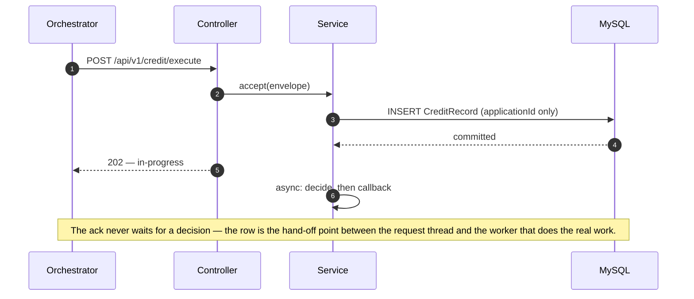
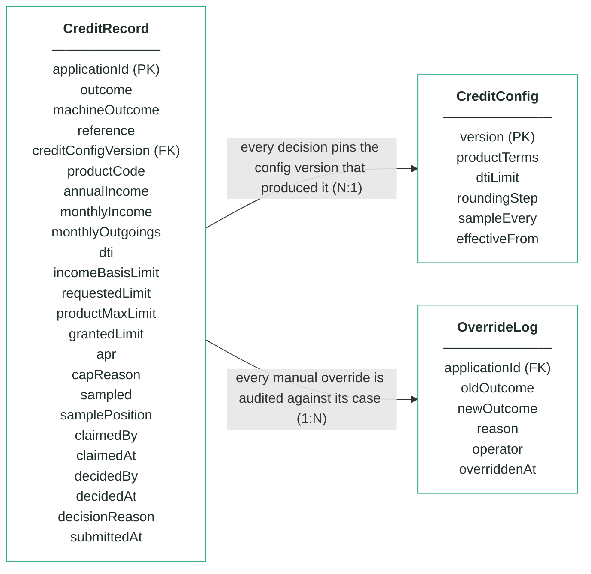
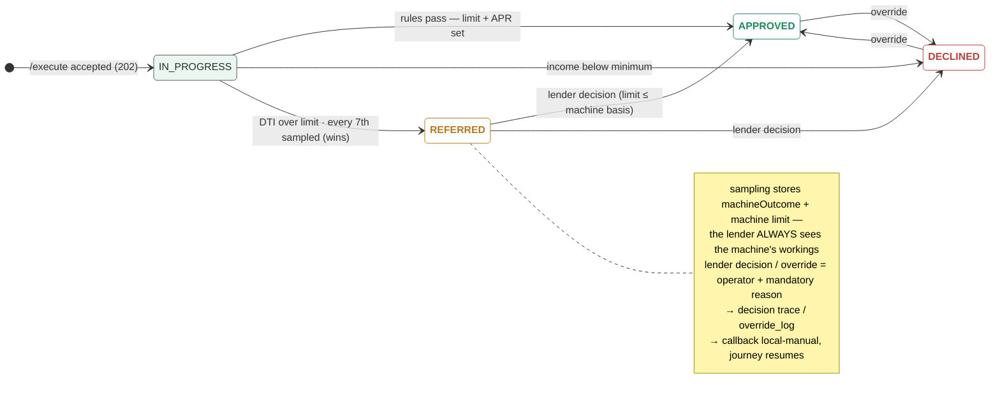

# Module 5 · Credit Decisioning — UC 00 · Process Application

> AI implementation brief, generated from the v5 spec (`spec/.../use-cases/`). Source of truth is the spec; regenerate, don't hand-edit.

## Context

- Module: 5 · Credit Decisioning · category Rule · domain `credit` · command `assess-credit` · outcomes: APPROVED, REFERRED, DECLINED
- Use case: 00 · Process Application · track B · prerequisite: none (foundation) · build shape: API→DB · primary screen: — feeds every screen (row visible on the board)
- Data effect: one INSERT + 202 ack
- Platform rules (non-negotiable): the orchestrator is the only caller; the whole application arrives in the envelope (plus the v5 `outputs` block, Option A); steps are independent and re-orderable; the payload is NEVER stored — only `applicationId`; every module ships `GET /cases/{id}/applicant` proxying the orchestrator; big lists are empty by default and capped at 10 rows (≤10 hydration calls); ALL APIs are idempotent — same request twice, same result once; every endpoint appears in the service's OpenAPI 3.0 (Swagger) spec.

## Story

As the orchestrator I need every execute request acknowledged immediately and recorded durably, so the journey can advance and every other use case has a row to work on.

## Contract

```
POST /api/v1/credit/execute
{ applicationId, correlationId,
  command: "assess-credit",
  application: { … }, outputs: { … } }
→ 202 Accepted
{ "status": "in-progress",
  "applicationId": "app-1234",
  "command": "assess-credit" }
```

## Acceptance criteria

1. POST /api/v1/credit/execute with a valid envelope → 202 Accepted immediately — no rule or provider work happens on the request thread; body carries status "in-progress", the applicationId and the command.
2. Before the 202 is sent, exactly ONE CreditRecord row exists, keyed by applicationId, in an in-progress state — a crash right after the ack loses nothing.  ⟵ **checkpoint — exact value**
3. Only the applicationId is persisted from the envelope — zero payload columns; the application object is handed to the off-thread worker, never stored.
4. Repeated /execute for the same applicationId → 202 again, still one row, no re-processing; once decided, the callback replays the stored outcome.
5. A malformed envelope (missing applicationId or command) → 400 with a JSON error body, and nothing is stored.
6. The off-thread decision starts only after the row is committed — everything in this module triggers from this row.
7. The new row is immediately visible to the search and case endpoints as an in-progress case.

## Expected data changes

- **INSERT one CreditRecord row** keyed by applicationId — the ONLY applicant data ever stored.
- The row starts in-progress; every later use case UPDATEs or reads this same row.
- Idempotency = the unique key on applicationId; the trigger point = the commit.

## The Application entity — every field that arrives in the API

> The whole Application object is delivered in the envelope on every call. Fields this module reads are marked ●. The payload is NEVER stored — only `applicationId`.

| field | example | meaning |
|---|---|---|
| ● applicationId | app-1234 | journey key — every record this module stores is keyed by it |
| channel | MOBILE_APP | where the application was made — module 1's business, no credit rule reads it |
| submittedAt | 2026-07-21T21:40:00Z | when the customer submitted — timestamps always UTC |
| applicant.fullName | Maria Nowak | modules 2/3/4 match on it — credit judges numbers, not names; the UI shows it via the live proxy only |
| applicant.dateOfBirth | 1996-04-11 | module 1 checks age against the product — not a credit input here |
| applicant.email / mobile | maria@…  +4477… | contact for module 6's agreement — ignored here |
| applicant.nationality | PL | module 3's document cross-check — ignored here |
| applicant.countryOfResidence | GB | module 4's jurisdiction input — ignored here |
| applicant.taxResidencies | ["GB"] | module 2's policy fact — ignored here |
| applicant.currentAddress | 42 Hanbury St, E1 5JP | module 8 posts the card — monthsAtAddress next to it is candidate 09's stability input |
| identityDocument.* | PASSPORT · ZS1234567 | module 3's provider payload — not a credit input |
| employment.status / employerName / months | PERMANENT · 11 | candidate inputs, not locked ones: status feeds candidate 11's weighting, months feeds candidate 10's tenure rule |
| ● finances.annualIncome | 34000 | rule 1: against the product's minIncome · rule 2: ÷12 = monthly income, the DTI denominator · rule 3: one month's income is the first limit candidate |
| ● finances.monthlyHousingCost / existingCreditCommitments | 1000 · 180 | rule 2: summed = monthly outgoings, the DTI numerator — the whole affordability story |
| ● product.productCode | CREDIT_CARD_REWARDS | selects the CreditConfig terms this decision runs under: minIncome, maxLimit, APR |
| ● product.requestedCreditLimit | 3000 | rule 3: the third limit candidate — never grant more than asked; capping to it is CRE_LIMIT_CAPPED_TO_REQUEST |
| delivery.useCurrentAddress / address | true · null | module 8's delivery decision — ignored here |
| consents.termsAccepted | true | module 1 enforces it, module 6 re-reads it — not a credit input |
| consents.paperless / marketingConsent | true · false | statement + marketing preferences — nothing to decide here |
| outputs  (v5 · Option A) | { } | step results accumulated by the orchestrator — THIS module is why it exists: the orchestrator copies approvedLimit + apr from the credit callback into outputs for modules 6, 7 and 8. Never read here |

_Ground rules: unknown fields are ignored on the way in and never emitted on the way out · countries ISO alpha-2 uppercase · dates YYYY-MM-DD · money = integer GBP · optional = null, never "" or 0._

## Diagrams

> Rendered images first (for PDF/preview); the mermaid source is collapsed underneath for machine consumption.

### Sequence — this use case


<details><summary>mermaid source</summary>



</details>

### Entity model (suggested — the shape to beat)


**CreditRecord — one row per decision; applicationId is the only applicant identifier**

| field | type | key | meaning |
|---|---|---|---|
| applicationId | string | PK | the journey key from the envelope — the ONLY applicant-related column in this schema |
| outcome | enum |  | the final answer: APPROVED, REFERRED or DECLINED — starts equal to machineOutcome; only a human decision can change it |
| machineOutcome | enum |  | what rules 1–3 computed before sampling — kept so the machine's own answer stays visible after any human touch |
| reference | string |  | human-facing case reference shown on every screen, e.g. cre-000517 |
| creditConfigVersion | int | FK | the CreditConfig version that decided this case — pinned forever, never re-pointed |
| productCode | string |  | the product whose terms were applied (STANDARD / REWARDS / STUDENT) |
| annualIncome | int |  | workings — income as read from the envelope at decision time |
| monthlyIncome | int |  | workings — annualIncome ÷ 12, the DTI denominator |
| monthlyOutgoings | int |  | workings — declared monthly outgoings from the envelope, the DTI numerator |
| dti | decimal(4,2), nullable |  | workings — monthlyOutgoings ÷ monthlyIncome; null when income is zero (uncomputable) |
| incomeBasisLimit | int |  | workings — the limit implied by income, before any cap is applied |
| requestedLimit | int |  | workings — the limit the applicant asked for |
| productMaxLimit | int |  | workings — the product ceiling from the pinned config version |
| grantedLimit | int, nullable |  | workings — the limit actually granted; null unless approved |
| apr | decimal(3,1) |  | the APR attached to the decision, from the pinned product terms |
| capReason | enum, nullable |  | which cap won: TO_REQUEST or TO_BAND_MAX; null when the income basis was already lowest |
| sampled | boolean |  | rule 4 — true when this clean approval was the every-Xth case pulled for human review |
| samplePosition | int, nullable |  | the sampling counter value that triggered the pull |
| claimedBy | string, nullable |  | referred queue — the operator who claimed the case |
| claimedAt | timestamp, nullable |  | referred queue — when it was claimed |
| decidedBy | string, nullable |  | who made the human decision (queue or override) |
| decidedAt | timestamp, nullable |  | when the human decision was made |
| decisionReason | string, nullable |  | the mandatory reason recorded with every human decision |
| submittedAt | timestamp |  | when the orchestrator submitted the case |

**CreditConfig — insert-only, versioned terms; the current version is the highest**

| field | type | key | meaning |
|---|---|---|---|
| version | int | PK | one new row per change — rows are inserted, never updated |
| productTerms | JSON |  | per-product terms — minIncome, maxLimit, apr for STANDARD / REWARDS / STUDENT (seeded from the api-contract catalogue) |
| dtiLimit | decimal |  | the DTI line — decisions above it go to a human (seeded 0.45) |
| roundingStep | int |  | granted limits are floored to this step (seeded £100) |
| sampleEvery | int |  | rule 4's X — every Xth clean approval is sampled for review (seeded 7) |
| effectiveFrom | timestamp |  | when this version became the current one |

**OverrideLog — audit trail; one row per manual override, none ever deleted**

| field | type | key | meaning |
|---|---|---|---|
| applicationId | string | FK | the case that was overridden |
| oldOutcome | enum |  | the outcome before the override |
| newOutcome | enum |  | the outcome after the override |
| reason | string |  | the mandatory justification typed by the operator |
| operator | string |  | who performed the override |
| overriddenAt | timestamp |  | when it happened |

Relationships: CreditRecord N:1 CreditConfig — every decision pins the config version that produced it · CreditRecord 1:N OverrideLog — every manual override is audited against its case

<details><summary>mermaid source (generated from the spec tables)</summary>



</details>

### State transitions — the case record


<details><summary>mermaid source</summary>



</details>

## Out of scope

Deciding anything (that is the engine use case, which runs off-thread AFTER this row exists); the callback content.

## Build notes

Partially implemented by the template — the 202-then-callback controller is given. Your work: the durable CreditRecord row, idempotency by applicationId, and the async hand-off. EVERY other use case depends on this one: no row, no review, no queue, no override, no report.

## Tests

Slice test: 202 shape + row inserted before the ack returns; repeated /execute → one row; malformed envelope → 400 and nothing stored.

## Sequence caption

The ack never waits for a decision — the row is the hand-off point between the request thread and the worker that does the real work.

## Definition of done

All acceptance criteria verified against the running app · `./mvnw test` green · teammate-reviewed PR merged to main · fresh clone builds green · endpoint idempotent + present in the OpenAPI 3.0 (Swagger) spec · demoable from the UI.
