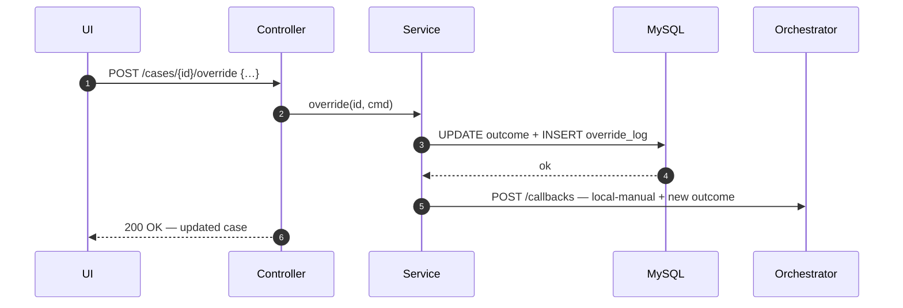
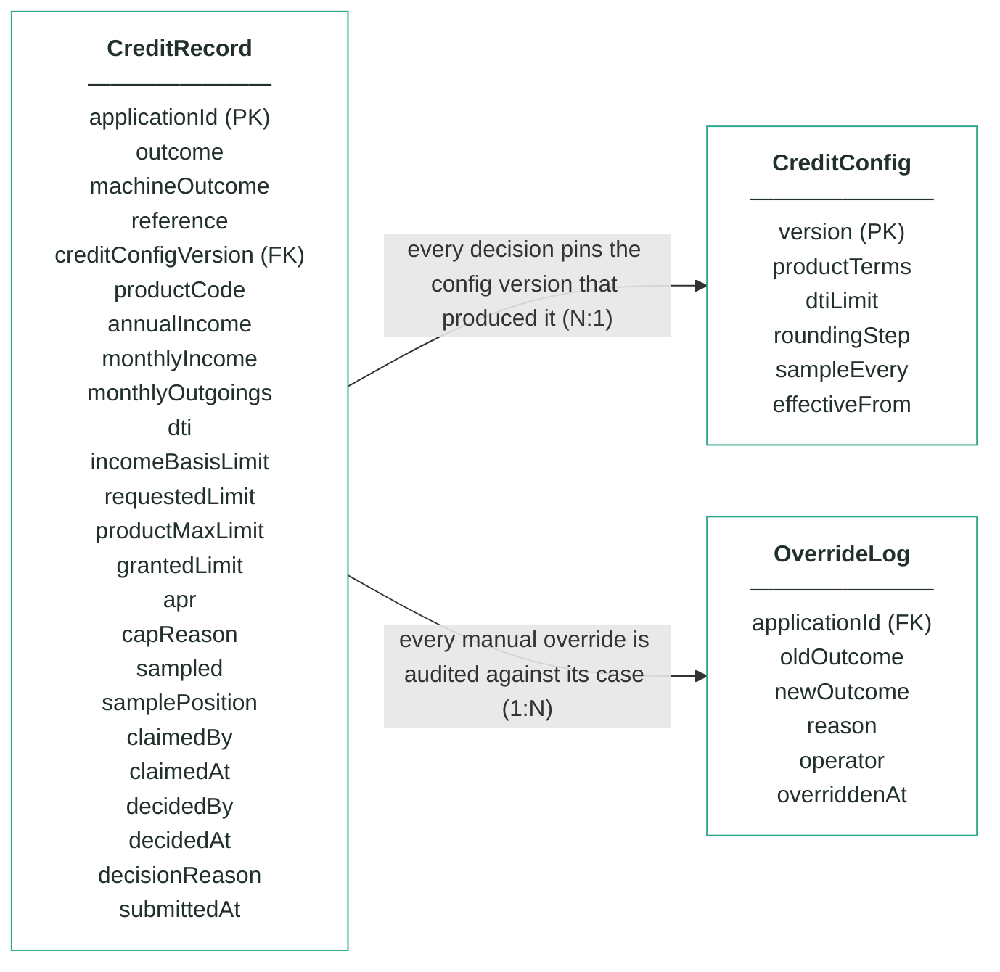
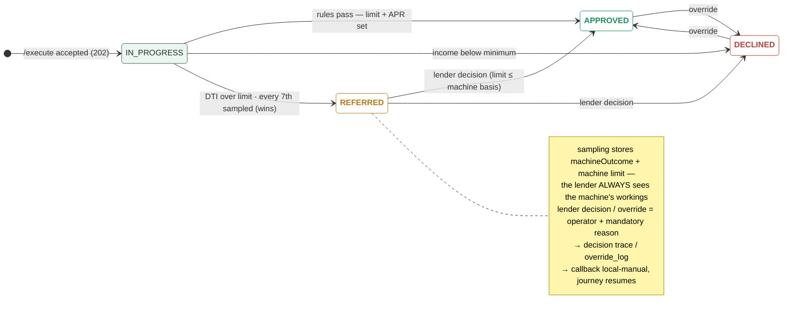

# Module 5 · Credit Decisioning — UC 08 · Override Case

> AI implementation brief, generated from the v5 spec (`spec/.../use-cases/`). Source of truth is the spec; regenerate, don't hand-edit.

## Context

- Module: 5 · Credit Decisioning · category Rule · domain `credit` · command `assess-credit` · outcomes: APPROVED, REFERRED, DECLINED
- Use case: 08 · Override Case · track B · prerequisite: after 02 is wired · build shape: DB-write→API→FE · primary screen: Override modal
- Data effect: two writes + one callback
- Platform rules (non-negotiable): the orchestrator is the only caller; the whole application arrives in the envelope (plus the v5 `outputs` block, Option A); steps are independent and re-orderable; the payload is NEVER stored — only `applicationId`; every module ships `GET /cases/{id}/applicant` proxying the orchestrator; big lists are empty by default and capped at 10 rows (≤10 hydration calls); ALL APIs are idempotent — same request twice, same result once; every endpoint appears in the service's OpenAPI 3.0 (Swagger) spec.

## Story

As a bank employee I want to override a wrong credit decision with a reason — a decline built on a mistyped income the customer has since evidenced, an approval that new information contradicts.

## Contract

```
POST /cases/{id}/override
{"newOutcome":"APPROVED","grantedLimit":2800,
 "reason":"income evidenced at 34k — decline was on a typo",
 "operator":"b.dimovski"}
→ 200 + updated case
```

## Acceptance criteria

1. POST /cases/{id}/override {newOutcome, reason, operator} → 200; the case's outcome updates immediately.
2. reason and operator are mandatory → 400 without either; newOutcome must be APPROVED, REFERRED or DECLINED; APPROVED additionally requires grantedLimit ≤ the stored three-way minimum → 422 above it.
3. An override_log row is written: applicationId, old outcome, new outcome, granted limit (when set), reason, operator, timestamp.
4. The module POSTs a fresh callback with status local-manual and CRE_MANUAL_APPROVED (detail carries limit + APR) or CRE_MANUAL_DECLINED.
5. Overriding a DECLINED case to APPROVED at £2,800 shows the new outcome and limit on the board, and the override in the case history.  ⟵ **checkpoint — exact value**
6. The original workings and machineOutcome stay untouched — the record shows what the machine computed AND what the human decided.
7. Overriding to REFERRED puts the case into the referred queue, unclaimed.

## Expected data changes

- **UPDATE credit_record** SET outcome (+ granted_limit on approval) — nothing else may ever change here.
- **INSERT override_log** (old, new, limit, reason, operator, at).
- Callback status local-manual tells the orchestrator a human decided — the journey resumes.
- Workings columns + machineOutcome untouched: the arithmetic is preserved forever.

## Diagrams

> Rendered images first (for PDF/preview); the mermaid source is collapsed underneath for machine consumption.

### Sequence — this use case


<details><summary>mermaid source</summary>



</details>

### Entity model (suggested — the shape to beat)


**CreditRecord — one row per decision; applicationId is the only applicant identifier**

| field | type | key | meaning |
|---|---|---|---|
| applicationId | string | PK | the journey key from the envelope — the ONLY applicant-related column in this schema |
| outcome | enum |  | the final answer: APPROVED, REFERRED or DECLINED — starts equal to machineOutcome; only a human decision can change it |
| machineOutcome | enum |  | what rules 1–3 computed before sampling — kept so the machine's own answer stays visible after any human touch |
| reference | string |  | human-facing case reference shown on every screen, e.g. cre-000517 |
| creditConfigVersion | int | FK | the CreditConfig version that decided this case — pinned forever, never re-pointed |
| productCode | string |  | the product whose terms were applied (STANDARD / REWARDS / STUDENT) |
| annualIncome | int |  | workings — income as read from the envelope at decision time |
| monthlyIncome | int |  | workings — annualIncome ÷ 12, the DTI denominator |
| monthlyOutgoings | int |  | workings — declared monthly outgoings from the envelope, the DTI numerator |
| dti | decimal(4,2), nullable |  | workings — monthlyOutgoings ÷ monthlyIncome; null when income is zero (uncomputable) |
| incomeBasisLimit | int |  | workings — the limit implied by income, before any cap is applied |
| requestedLimit | int |  | workings — the limit the applicant asked for |
| productMaxLimit | int |  | workings — the product ceiling from the pinned config version |
| grantedLimit | int, nullable |  | workings — the limit actually granted; null unless approved |
| apr | decimal(3,1) |  | the APR attached to the decision, from the pinned product terms |
| capReason | enum, nullable |  | which cap won: TO_REQUEST or TO_BAND_MAX; null when the income basis was already lowest |
| sampled | boolean |  | rule 4 — true when this clean approval was the every-Xth case pulled for human review |
| samplePosition | int, nullable |  | the sampling counter value that triggered the pull |
| claimedBy | string, nullable |  | referred queue — the operator who claimed the case |
| claimedAt | timestamp, nullable |  | referred queue — when it was claimed |
| decidedBy | string, nullable |  | who made the human decision (queue or override) |
| decidedAt | timestamp, nullable |  | when the human decision was made |
| decisionReason | string, nullable |  | the mandatory reason recorded with every human decision |
| submittedAt | timestamp |  | when the orchestrator submitted the case |

**CreditConfig — insert-only, versioned terms; the current version is the highest**

| field | type | key | meaning |
|---|---|---|---|
| version | int | PK | one new row per change — rows are inserted, never updated |
| productTerms | JSON |  | per-product terms — minIncome, maxLimit, apr for STANDARD / REWARDS / STUDENT (seeded from the api-contract catalogue) |
| dtiLimit | decimal |  | the DTI line — decisions above it go to a human (seeded 0.45) |
| roundingStep | int |  | granted limits are floored to this step (seeded £100) |
| sampleEvery | int |  | rule 4's X — every Xth clean approval is sampled for review (seeded 7) |
| effectiveFrom | timestamp |  | when this version became the current one |

**OverrideLog — audit trail; one row per manual override, none ever deleted**

| field | type | key | meaning |
|---|---|---|---|
| applicationId | string | FK | the case that was overridden |
| oldOutcome | enum |  | the outcome before the override |
| newOutcome | enum |  | the outcome after the override |
| reason | string |  | the mandatory justification typed by the operator |
| operator | string |  | who performed the override |
| overriddenAt | timestamp |  | when it happened |

Relationships: CreditRecord N:1 CreditConfig — every decision pins the config version that produced it · CreditRecord 1:N OverrideLog — every manual override is audited against its case

<details><summary>mermaid source (generated from the spec tables)</summary>



</details>

### State transitions — the case record


<details><summary>mermaid source</summary>



</details>

## Out of scope

Deleting or editing any other field of the record; overriding a case that does not exist (404). Working the referred queue — that is UC 04, with its claim discipline.

## Build notes

The ONE permitted mutation outside the queue path. Writes the shared override_log and re-notifies the orchestrator with callback status local-manual and CRE_MANUAL_APPROVED (detail: limit + APR) or CRE_MANUAL_DECLINED. Overriding TO APPROVED requires a grantedLimit — same ceiling as the queue: never above the stored three-way arithmetic. Overriding to REFERRED sends the case into the queue, unclaimed.

## Tests

Slice test: happy path, missing reason → 400, unknown id → 404, approve above the machine basis → 422; service test asserts the callback fires once.

## Definition of done

All acceptance criteria verified against the running app · `./mvnw test` green · teammate-reviewed PR merged to main · fresh clone builds green · endpoint idempotent + present in the OpenAPI 3.0 (Swagger) spec · demoable from the UI.
