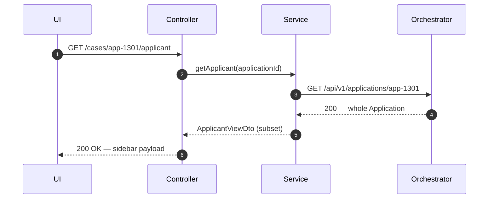
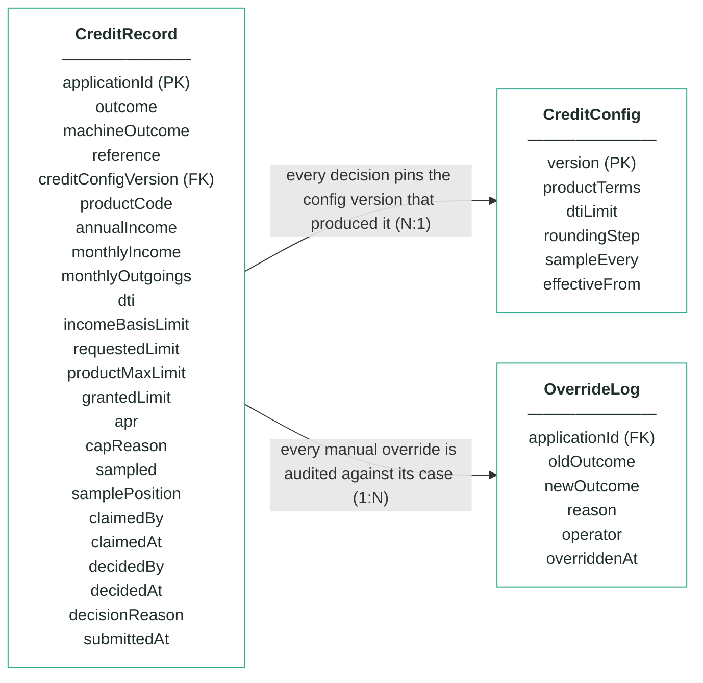
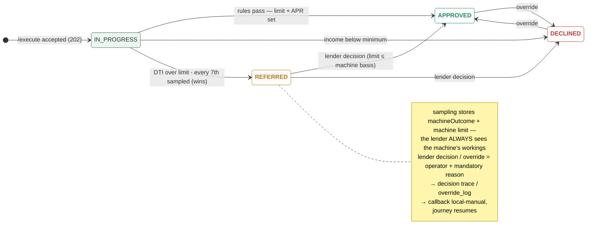

# Module 5 · Credit Decisioning — UC 03 · View Applicant

> AI implementation brief, generated from the v5 spec (`spec/.../use-cases/`). Source of truth is the spec; regenerate, don't hand-edit.

## Context

- Module: 5 · Credit Decisioning · category Rule · domain `credit` · command `assess-credit` · outcomes: APPROVED, REFERRED, DECLINED
- Use case: 03 · View Applicant · track D · prerequisite: screen shell from 02 · build shape: API+FE · primary screen: Decision Workings sidebar
- Data effect: none — by design
- Platform rules (non-negotiable): the orchestrator is the only caller; the whole application arrives in the envelope (plus the v5 `outputs` block, Option A); steps are independent and re-orderable; the payload is NEVER stored — only `applicationId`; every module ships `GET /cases/{id}/applicant` proxying the orchestrator; big lists are empty by default and capped at 10 rows (≤10 hydration calls); ALL APIs are idempotent — same request twice, same result once; every endpoint appears in the service's OpenAPI 3.0 (Swagger) spec.

## Story

As a bank employee I want to see who a credit decision is about without leaving the record — and without this module ever copying applicant data.

## Contract

```
GET /cases/{id}/applicant →  (proxy)
GET {orchestratorUrl}/api/v1/
        applications/{applicationId}
→ { …whole Application object… }
```

## Acceptance criteria

1. The Decision Workings sidebar renders fullName, dateOfBirth, employment.status, finances (annualIncome, monthlyHousingCost, existingCreditCommitments) and product.requestedCreditLimit — fetched live.
2. For app-1301 the sidebar shows Daniel Osei · PERMANENT · £48,000 — the lender reads the person beside the DTI that referred him.  ⟵ **checkpoint — exact value**
3. Nothing from the response is persisted — restart the module, the sidebar still works, the schema still holds zero applicant-identifying columns.
4. Orchestrator unreachable → the sidebar shows a retryable error state; the workings panel still renders every stored number from local data.
5. The proxy passes applicationId through untouched — no id mapping tables.

## Expected data changes

- **Zero writes, zero copies.** The whole point: one copy of the truth, owned by the orchestrator.
- MySQL is not even touched on this path.
- If the orchestrator is down the module stays healthy — the workings are local, only the sidebar degrades.

## Diagrams

> Rendered images first (for PDF/preview); the mermaid source is collapsed underneath for machine consumption.

### Sequence — this use case


<details><summary>mermaid source</summary>



</details>

### Entity model (suggested — the shape to beat)


**CreditRecord — one row per decision; applicationId is the only applicant identifier**

| field | type | key | meaning |
|---|---|---|---|
| applicationId | string | PK | the journey key from the envelope — the ONLY applicant-related column in this schema |
| outcome | enum |  | the final answer: APPROVED, REFERRED or DECLINED — starts equal to machineOutcome; only a human decision can change it |
| machineOutcome | enum |  | what rules 1–3 computed before sampling — kept so the machine's own answer stays visible after any human touch |
| reference | string |  | human-facing case reference shown on every screen, e.g. cre-000517 |
| creditConfigVersion | int | FK | the CreditConfig version that decided this case — pinned forever, never re-pointed |
| productCode | string |  | the product whose terms were applied (STANDARD / REWARDS / STUDENT) |
| annualIncome | int |  | workings — income as read from the envelope at decision time |
| monthlyIncome | int |  | workings — annualIncome ÷ 12, the DTI denominator |
| monthlyOutgoings | int |  | workings — declared monthly outgoings from the envelope, the DTI numerator |
| dti | decimal(4,2), nullable |  | workings — monthlyOutgoings ÷ monthlyIncome; null when income is zero (uncomputable) |
| incomeBasisLimit | int |  | workings — the limit implied by income, before any cap is applied |
| requestedLimit | int |  | workings — the limit the applicant asked for |
| productMaxLimit | int |  | workings — the product ceiling from the pinned config version |
| grantedLimit | int, nullable |  | workings — the limit actually granted; null unless approved |
| apr | decimal(3,1) |  | the APR attached to the decision, from the pinned product terms |
| capReason | enum, nullable |  | which cap won: TO_REQUEST or TO_BAND_MAX; null when the income basis was already lowest |
| sampled | boolean |  | rule 4 — true when this clean approval was the every-Xth case pulled for human review |
| samplePosition | int, nullable |  | the sampling counter value that triggered the pull |
| claimedBy | string, nullable |  | referred queue — the operator who claimed the case |
| claimedAt | timestamp, nullable |  | referred queue — when it was claimed |
| decidedBy | string, nullable |  | who made the human decision (queue or override) |
| decidedAt | timestamp, nullable |  | when the human decision was made |
| decisionReason | string, nullable |  | the mandatory reason recorded with every human decision |
| submittedAt | timestamp |  | when the orchestrator submitted the case |

**CreditConfig — insert-only, versioned terms; the current version is the highest**

| field | type | key | meaning |
|---|---|---|---|
| version | int | PK | one new row per change — rows are inserted, never updated |
| productTerms | JSON |  | per-product terms — minIncome, maxLimit, apr for STANDARD / REWARDS / STUDENT (seeded from the api-contract catalogue) |
| dtiLimit | decimal |  | the DTI line — decisions above it go to a human (seeded 0.45) |
| roundingStep | int |  | granted limits are floored to this step (seeded £100) |
| sampleEvery | int |  | rule 4's X — every Xth clean approval is sampled for review (seeded 7) |
| effectiveFrom | timestamp |  | when this version became the current one |

**OverrideLog — audit trail; one row per manual override, none ever deleted**

| field | type | key | meaning |
|---|---|---|---|
| applicationId | string | FK | the case that was overridden |
| oldOutcome | enum |  | the outcome before the override |
| newOutcome | enum |  | the outcome after the override |
| reason | string |  | the mandatory justification typed by the operator |
| operator | string |  | who performed the override |
| overriddenAt | timestamp |  | when it happened |

Relationships: CreditRecord N:1 CreditConfig — every decision pins the config version that produced it · CreditRecord 1:N OverrideLog — every manual override is audited against its case

<details><summary>mermaid source (generated from the spec tables)</summary>



</details>

### State transitions — the case record


<details><summary>mermaid source</summary>



</details>

## Out of scope

Caching applicant data; storing any applicant field in this module's schema (the workings columns store this module's arithmetic — nothing identifying).

## Build notes

THE standard application-fetch GET every module ships (v5 platform rule) — the same proxy hydrates the board's name column (UC 01) and the queue's rows (UC 04). It goes to the orchestrator only, server-side, so the browser needs no CORS exception. The sidebar shows the declared finances beside the stored workings — the lender sees input and arithmetic together.

## Tests

Service test with a mocked orchestrator client: happy path + orchestrator down → sidebar error, workings still render.

## Definition of done

All acceptance criteria verified against the running app · `./mvnw test` green · teammate-reviewed PR merged to main · fresh clone builds green · endpoint idempotent + present in the OpenAPI 3.0 (Swagger) spec · demoable from the UI.
