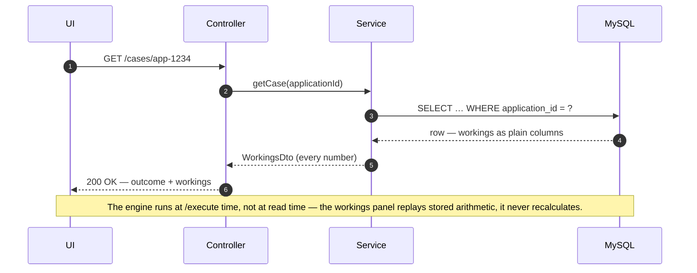
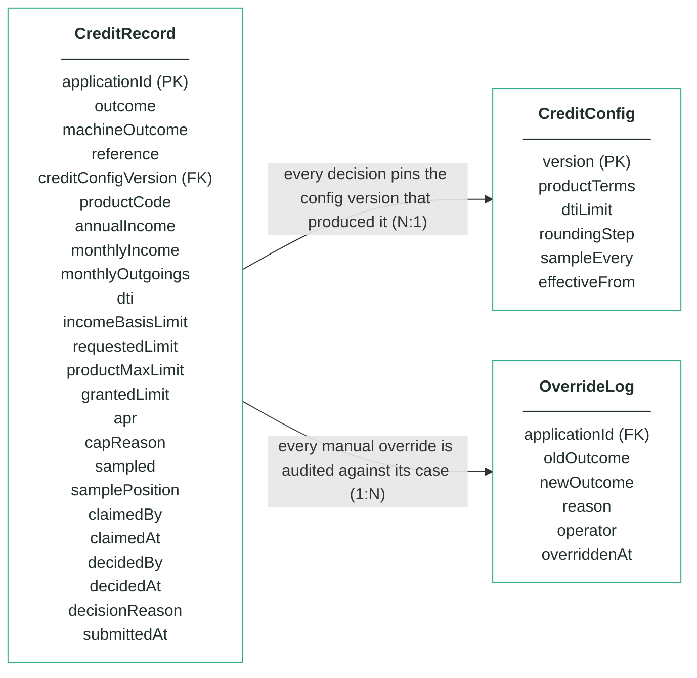
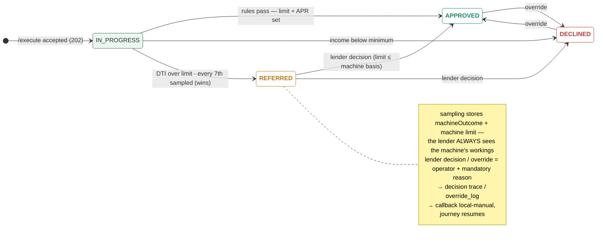

# Module 5 · Credit Decisioning — UC 02 · Review Decision Workings

> AI implementation brief, generated from the v5 spec (`spec/.../use-cases/`). Source of truth is the spec; regenerate, don't hand-edit.

## Context

- Module: 5 · Credit Decisioning · category Rule · domain `credit` · command `assess-credit` · outcomes: APPROVED, REFERRED, DECLINED
- Use case: 02 · Review Decision Workings · track B · prerequisite: after 00 + 06 — the terms come from CreditConfig · build shape: API+FE (engine: DB) · primary screen: Decision Workings
- Data effect: read-only (row written earlier)
- Platform rules (non-negotiable): the orchestrator is the only caller; the whole application arrives in the envelope (plus the v5 `outputs` block, Option A); steps are independent and re-orderable; the payload is NEVER stored — only `applicationId`; every module ships `GET /cases/{id}/applicant` proxying the orchestrator; big lists are empty by default and capped at 10 rows (≤10 hydration calls); ALL APIs are idempotent — same request twice, same result once; every endpoint appears in the service's OpenAPI 3.0 (Swagger) spec.

## Story

As a bank employee I want to open a credit decision and see every number behind it — monthly income, outgoings, DTI, the three limit candidates, the rounding, the caps — enough to explain it to the customer.

## Contract

```
GET /cases/{applicationId} →
{"outcome":"APPROVED","machineOutcome":"APPROVED",
 "reference":"cre-000517","creditConfigVersion":1,
 "workings":{"annualIncome":34000,
  "monthlyIncome":2833,"monthlyOutgoings":1180,
  "dti":0.42,"dtiLimit":0.45,
  "incomeBasisLimit":2833,"productMaxLimit":10000,
  "requestedLimit":3000,"grantedLimit":2800,
  "apr":24.9,"capReason":null},
 "sampling":{"sampled":false}}
```

## Acceptance criteria

1. GET /cases/{applicationId} → 200 + outcome, machineOutcome, reference, creditConfigVersion, the full workings block and the sampling block.
2. Maria Nowak (app-1234): monthlyIncome 2833, monthlyOutgoings 1180, DTI 0.42, candidates 2833/10000/3000 → grantedLimit 2800, apr 24.9, outcome APPROVED with CRE_APPROVED.  ⟵ **checkpoint — exact value**
3. Daniel Osei (app-1301): monthlyIncome 4000, outgoings 2320, DTI 0.58 → REFERRED with CRE_AFFORDABILITY_EXCEEDED — no matter how high the income.  ⟵ **checkpoint — exact value**
4. Chloe Barrett (app-1310): £14,000 against the REWARDS minimum £20,000 → DECLINED with CRE_INCOME_BELOW_MINIMUM; affordability is never computed, DTI is null.  ⟵ **checkpoint — exact value**
5. Zero annualIncome on the STUDENT card (minIncome 0) → DTI null, REFERRED with CRE_AFFORDABILITY_EXCEEDED — no division-by-zero, ever.
6. A calculated basis above the request caps to the request with CRE_LIMIT_CAPPED_TO_REQUEST; a request above the product max caps to the max with CRE_LIMIT_CAPPED_TO_BAND_MAX — and is NOT a decline.
7. DTI exactly 0.45 passes rule 2 — the limit is "above", not "at or above"; the boundary is tested.
8. The fixture's 21st credit decision (app-1296) → REFERRED with CRE_SAMPLED_FOR_REVIEW, machineOutcome APPROVED, its machine limit stored in the workings.  ⟵ **checkpoint — exact value**
9. Repeated /execute for the same applicationId → still one row, no recalculation, callback replays the stored outcome; unknown applicationId → 404 with a JSON error body.

## Expected data changes

- **This GET changes nothing.** The row it reads was written once, off-thread, by /execute.
- On /execute: INSERT credit_record — outcome, machineOutcome, every workings number as a plain column, creditConfigVersion pinned.
- Unique key on application_id is what makes the idempotency AC provable.

## Diagrams

> Rendered images first (for PDF/preview); the mermaid source is collapsed underneath for machine consumption.

### Sequence — this use case


<details><summary>mermaid source</summary>



</details>

### Entity model (suggested — the shape to beat)


**CreditRecord — one row per decision; applicationId is the only applicant identifier**

| field | type | key | meaning |
|---|---|---|---|
| applicationId | string | PK | the journey key from the envelope — the ONLY applicant-related column in this schema |
| outcome | enum |  | the final answer: APPROVED, REFERRED or DECLINED — starts equal to machineOutcome; only a human decision can change it |
| machineOutcome | enum |  | what rules 1–3 computed before sampling — kept so the machine's own answer stays visible after any human touch |
| reference | string |  | human-facing case reference shown on every screen, e.g. cre-000517 |
| creditConfigVersion | int | FK | the CreditConfig version that decided this case — pinned forever, never re-pointed |
| productCode | string |  | the product whose terms were applied (STANDARD / REWARDS / STUDENT) |
| annualIncome | int |  | workings — income as read from the envelope at decision time |
| monthlyIncome | int |  | workings — annualIncome ÷ 12, the DTI denominator |
| monthlyOutgoings | int |  | workings — declared monthly outgoings from the envelope, the DTI numerator |
| dti | decimal(4,2), nullable |  | workings — monthlyOutgoings ÷ monthlyIncome; null when income is zero (uncomputable) |
| incomeBasisLimit | int |  | workings — the limit implied by income, before any cap is applied |
| requestedLimit | int |  | workings — the limit the applicant asked for |
| productMaxLimit | int |  | workings — the product ceiling from the pinned config version |
| grantedLimit | int, nullable |  | workings — the limit actually granted; null unless approved |
| apr | decimal(3,1) |  | the APR attached to the decision, from the pinned product terms |
| capReason | enum, nullable |  | which cap won: TO_REQUEST or TO_BAND_MAX; null when the income basis was already lowest |
| sampled | boolean |  | rule 4 — true when this clean approval was the every-Xth case pulled for human review |
| samplePosition | int, nullable |  | the sampling counter value that triggered the pull |
| claimedBy | string, nullable |  | referred queue — the operator who claimed the case |
| claimedAt | timestamp, nullable |  | referred queue — when it was claimed |
| decidedBy | string, nullable |  | who made the human decision (queue or override) |
| decidedAt | timestamp, nullable |  | when the human decision was made |
| decisionReason | string, nullable |  | the mandatory reason recorded with every human decision |
| submittedAt | timestamp |  | when the orchestrator submitted the case |

**CreditConfig — insert-only, versioned terms; the current version is the highest**

| field | type | key | meaning |
|---|---|---|---|
| version | int | PK | one new row per change — rows are inserted, never updated |
| productTerms | JSON |  | per-product terms — minIncome, maxLimit, apr for STANDARD / REWARDS / STUDENT (seeded from the api-contract catalogue) |
| dtiLimit | decimal |  | the DTI line — decisions above it go to a human (seeded 0.45) |
| roundingStep | int |  | granted limits are floored to this step (seeded £100) |
| sampleEvery | int |  | rule 4's X — every Xth clean approval is sampled for review (seeded 7) |
| effectiveFrom | timestamp |  | when this version became the current one |

**OverrideLog — audit trail; one row per manual override, none ever deleted**

| field | type | key | meaning |
|---|---|---|---|
| applicationId | string | FK | the case that was overridden |
| oldOutcome | enum |  | the outcome before the override |
| newOutcome | enum |  | the outcome after the override |
| reason | string |  | the mandatory justification typed by the operator |
| operator | string |  | who performed the override |
| overriddenAt | timestamp |  | when it happened |

Relationships: CreditRecord N:1 CreditConfig — every decision pins the config version that produced it · CreditRecord 1:N OverrideLog — every manual override is audited against its case

<details><summary>mermaid source (generated from the spec tables)</summary>



</details>

### State transitions — the case record


<details><summary>mermaid source</summary>



</details>

## Out of scope

Editing a case (records are immutable — queue decision is UC 04, override is UC 08); the /execute wiring itself (template gives it).

## Build notes

The engine is ONE plain function: (application, CreditConfig) → decision + workings. Build and unit-test it before any Spring wiring — it is the easiest part to test properly and the easiest to get subtly wrong. Integer arithmetic: monthlyIncome = annualIncome / 12 truncated; DTI computed at 2 decimals; the £100 floor applies to the three-way minimum, at the end. Zero monthly income → DTI null → REFERRED, guarded before any division.

## Tests

Engine: table-driven unit tests — Maria's £2,800, Daniel's 0.58, Chloe's rule-1 decline, the £0-income student, both caps, boundary DTI exactly 0.45 (passes), sampling positions; slice test for the GET.

## Sequence caption

The engine runs at /execute time, not at read time — the workings panel replays stored arithmetic, it never recalculates.

## Definition of done

All acceptance criteria verified against the running app · `./mvnw test` green · teammate-reviewed PR merged to main · fresh clone builds green · endpoint idempotent + present in the OpenAPI 3.0 (Swagger) spec · demoable from the UI.
